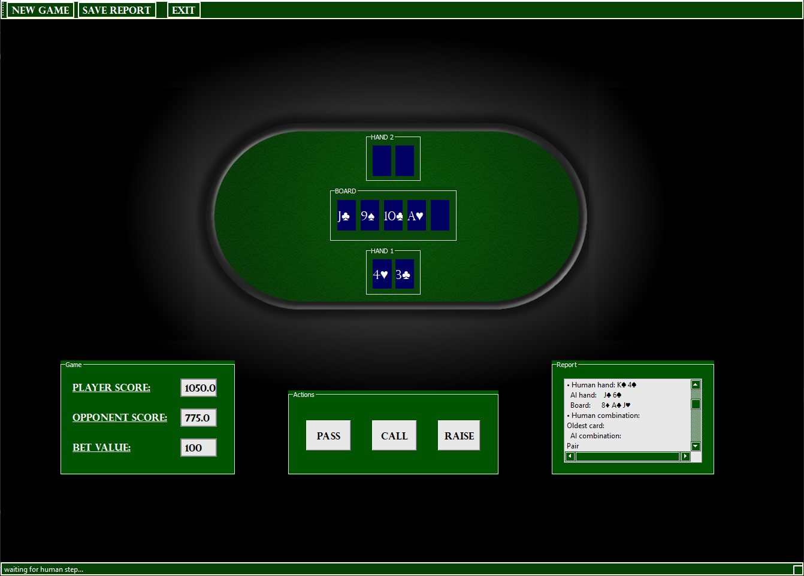

# ИИ для игры в Limited Heads-Up Poker
**Задача:** создать алгоритм, в основе которого лежит нейронная сеть, представляющий собой искусственный интеллект для игры в один из видов покера - *Limited Heads-Up Poker*.
В задачу входит:
- Выбор и реализация нейросети
- Её обучение
- Создание графической оболочки, демонстрирующей её работу
## Реализация:
### Интерфейс:

